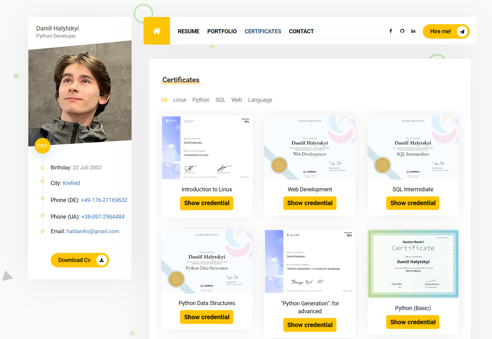

# Flask Portfolio Web

This is a Flask-based portfolio website designed to showcase my projects and skills. It includes features for
downloading my CV and certificates, as well as a contact form for inquiries.

Notice: This Flask project is outdated and does not serve as a true demonstration of my skills. For a more current
showcase of my abilities, please visit my Django portfolio repository
at https://github.com/haldaniko/Portfolio-DjangoWebsite.

## Features

- Home page displaying an overview of my portfolio.
- Individual project pages for detailed descriptions of my work.
- Downloadable CV and language certification documents.
- A contact form to submit inquiries, which saves data to a text file.

## Installation

```bash
git clone https://github.com/haldaniko/Portfolio-FlaskWebsite.git
cd Portfolio-FlaskWebsite

# on macOS
python3 -m venv venv
source venv/bin/activate

# on Windows
python -m venv venv
venv\Scripts\activate

pip install -r requirements.txt

python app.py
```

The Website will be available at `http://127.0.0.1:5000/`

## Demo
